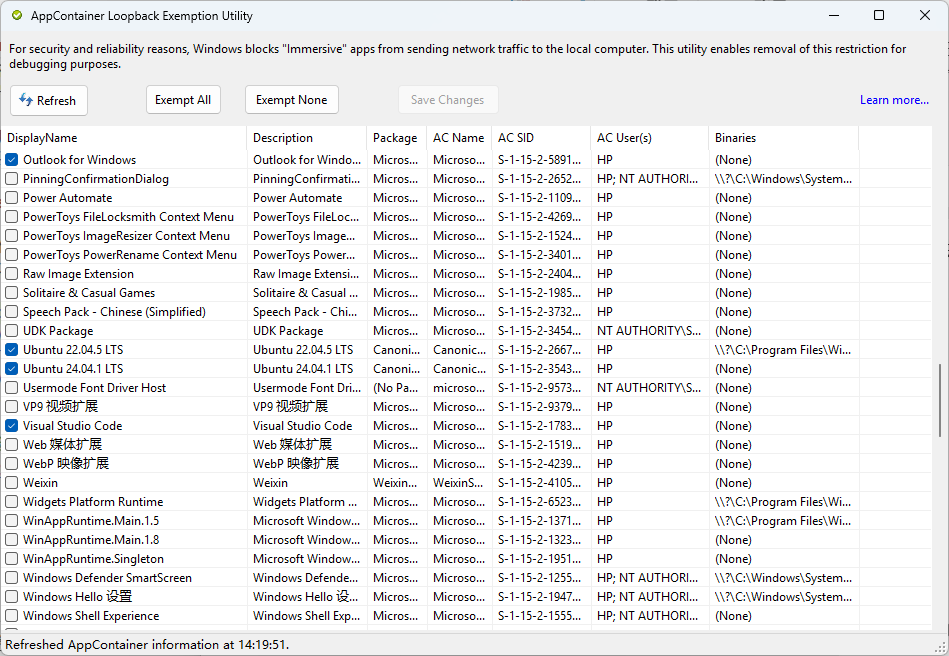

# 第20章 Windows系统下的全套环境

## 学习目标
- 在Windows 11环境下完成科研环境搭建
- 能根据自己的实际环境自行修改配置

## 关键概念
- VS Code开发界面
- conda环境管理
- GitHub版本控制与团队协作

## 正文

### 1. VS Code

VS Code（以下简称VS）应当是你一切工作的使用界面，不限平台。

#### 下载安装

首先[下载VS](https://code.visualstudio.com/download)。

注意VS应当进行用户级安装，即安装在`C:/User/{用户名}`下。

#### VS Code插件

安装完成后，需要为VS安装额外的插件/扩展（extension）。在VS左侧工具栏找到扩展标签，或按`ctrl + shift + x`进入。

- 必备插件
  - Chinses (Simplified)
  - Jupyter 系列
  - GitHub Copilot Chat
- 建议插件
  - GitHub Repositories
  - Rainbow CSV
  - Edit CSV
  - Markdown All in One
  - Office Viewer
  - WSL
  - Kimi Coder
- 美化
  - HarmonyOS Sans 字体
  - Pira Code 字体

#### 登录Microsoft账号

安装完插件后，在VS左下角点击账户按钮，选择登录以同步配置。使用你的Microsoft账号登录，该账号最好与你的Windows系统账号一致。

完成登录后，你所有的配置文件、已安装的插件都可以在云端同步。在其他地方再次安装VS后，只需要登录账号，就可以自动使用相同的配置与插件。

#### VS Code网络访问

在有些情况下，你需要VS访问国际互联网。由于Windows系统的一些特殊设置，仅仅使用VPN工具无法让VS完全使用代理服务器。需要进行以下调整：

- 关闭UWP loopback限制

    

- （可选）设置VS Code代理服务器
- （可选）使用TUN（虚拟网卡）模式
- （可选）更改VS Code账号认证方式
  - 设置-插件-Microsoft账号
  
  

#### 体验Copilot

默认情况下，VS Code的右功能侧栏为GitHub Copilot。AI助理有以下功能：

- 自动代码补全：根据当前context推理你所需要的功能，自动在光标位置补全代码
- plan模式：设计复杂功能；多针对编程场景，一般情况下不需要
- agent模式：在对话界面提供需求，由agent直接修改代码实现需求
- full-agent模式：比agent模式更高的权限，能自动使用系统工具、进行测试甚至直接进行分析，最后提供结果
- ask模式：类似Gemini、ChatGPT的对话模式
- 多模型：提供除Claude外多家主流AI模型，包括Gemini、GPT、GPT Codex

使用Copilot需要登录GitHub账号并订阅Copilot Pro或进行**学生认证**。

### 2. 环境管理与Python

准备一个全局环境管理工具。

#### 选择你的工具

Anaconda、miniconda、miniforge都是常用的环境管理工具，有细微区别：

- Anaconda[（下载地址）](https://www.anaconda.com/download/success)是由企业发布的一种Python发行版，内置了多种数据科学工具箱，如Jupyter、R、numpy、scipy等。占用空间较大，可视化窗口会有卡顿。个人使用理论上免费。
- miniconda[（下载地址）](https://www.anaconda.com/download/success)是Anaconda的轻量版，仅提供基础的环境管理功能，未内置上述工具箱。
- miniforge[（下载地址）](https://conda-forge.org/miniforge/)是社区维护的环境管理工具，完全开源、免费。使用体验类似miniconda。

如果你**什么都不懂**，可以选择Anaconda作为开始。其余情况，推荐使用miniforge。接下来以Anaconda为例进行讲解。

#### Anaconda安装与配置

1. 安装过程注意事项：

- 使用用户级安装。不建议修改安装路径。
- 勾选“默认Python”和“添加到环境变量”。

2. 安装完成后，打开Windows终端（PowerShell），进行初始化：

```bash
conda init powershell
```

完成初始化后，你应该可以在命令提示符前看到`(base)`字样，代表目前处于名为`base`的conda环境。可以关闭终端后，开启一个新终端进行检查。

3. 为conda配置国内镜像，在终端输入：

```bash
conda config --set show_channel_urls yes
```

然后来到`C:/User/{用户名}`目录，寻找`.condarc`文件，修改为以下内容：

```bash
channels:
  - defaults
show_channel_urls: true
default_channels:
  - https://mirrors.tuna.tsinghua.edu.cn/anaconda/pkgs/main
  - https://mirrors.tuna.tsinghua.edu.cn/anaconda/pkgs/r
  - https://mirrors.tuna.tsinghua.edu.cn/anaconda/pkgs/msys2
custom_channels:
  conda-forge: https://mirrors.tuna.tsinghua.edu.cn/anaconda/cloud
  pytorch: https://mirrors.tuna.tsinghua.edu.cn/anaconda/cloud
```

#### 配置VS Code

安装完anaconda后，可以在VS里把`base`环境下的python设置为默认解释器。

首先，为VS安装以下扩展：

- Python
- Pylance
- Python Environments
- Python Debugger

打开`设置-扩展-python`，在`Conda Path`项目中输入anaconda路径（如`C:\Users\{用户名}\anaconda3\Scripts`）。该路径必须包含`conda.exe`可执行文件。

在`Default Interpreter Path`项目中输入anaconda路径。该路径必须包含`python.exe`可执行文件。

#### （可选）新建conda环境

如果你手头存在多个项目，强烈建议你为不同项目设置不同的环境，以避免出现依赖冲突问题。在终端输入以下命令新建环境：

```bash
conda create {环境名}
conda activate {环境名}
```

如果执行正确，命令提示符前的`(base)`会变为`({环境名})`。

#### 使用conda安装新工具包

在终端输入以下命令，把新工具包安装到指定环境

```bash
conda install -n {环境名} {包名} -y
```

如果不使用`-n`参数，则安装到当前激活环境。

如果已成功配置VS代理，则不建议使用pip安装python包。最新版本的pip存在代理服务器协议解析问题。

### 3. R

#### 安装R

[R下载地址](https://mirrors.tuna.tsinghua.edu.cn/CRAN/)

此外，Windows系统还需要安装Rtools（下载地址同上）。

如果已经正确安装anaconda，那么有两种方式安装R：

- 经典方法：下载R安装包，在用户级只安装一个R，在VS里只使用这一个R
- conda方法：为每个环境单独安装、配置R，由conda进行管理

一般情况下，特别是只需要处理一个项目、不会面临包冲突问题时，可以使用经典方法。

同样，建议进行用户级安装，或至少不要把R安装到`C:/Program Files`、`C:/Program Files (x86)`路径。

#### 配置R镜像

在Windows环境下，可以在`C:/User/{}/Documents`找到`.Rprofile`文件。在其中新增以下内容：

```bash
options("repos" = c(CRAN="https://mirrors.tuna.tsinghua.edu.cn/CRAN/"))
```

#### 配置VS Code

首先，在VS上安装以下扩展：

- R
- R Debugger
- R Develoment
- R Extension Pack
- R Syntax

然后，打开`设置-扩展-R`，修改以下配置：
- 勾选`Bracketed Paste`
- 勾选`Plot: Use Httpgd`
- 填写`Rpath: Windows`，路径为R安装路径，必须包含`R.exe`文件
  - 可使用`R.home()`获取准确路径
- （可选）填写`Rterm: Windows`，路径为`Anaconda路径/scripts/radian.exe`

最后，打开R终端，安装以下包，并注册Jupyter内核：

```r
install.packages(c('httpd', 'lsp', 'irkernel'))
IRkernel::installspec(name = 'ir', displayname = '{环境名}')
```

完成配置后，可以进行以下测试：

- 打开R终端
- 新建R脚本并运行
- 新建Jupyter Notebook，使用R内核并运行

在VS Code中支持至少两种方式使用R：

- 直接写R脚本运行，类似于RStudio，可以在左侧工具栏R标签查看变量、说明
- 在Jupyter中运行，与python内核体验一致
- （测试）使用`Rmd Notebooks for VS Code`插件，在`rmd`格式中运行

#### （可选）使用conda管理R

你可以使用conda对R进行统一管理，包括R本身的安装以及R包的安装：

```bash
conda install r-base r-essential -n {环境名} -y
conda install r-{R包名} -n {环境名} -y
```

此时不再建议使用`install.packages()`方式安装R包。使用该方式安装R，需相应调整VS配置文件中的R路径。

### 4. MATLAB

强烈建议不要安装2025及以上版本的MATLAB，新的UI接口会导致部分MATLAB报错。

#### MATLAB的home和root

#### 配置VS Code

首先，安装以下扩展：

- MATLAB
- Matlab in VSCode (fixed)
- matlab-formatter

打开`设置-扩展-MATLAB`，修改以下配置：

- 填写`MATLAB: Install Path`
  - 可通过`matlabroot`获取
- 勾选`MATLAB: Start Debugger Automatically`

#### （可选）安装python-matlab引擎

- 首先，确认自己已安装的MATLAB需求的python版本（[参考连接](https://www.mathworks.com/support/requirements/python-compatibility.html)）
- 使用conda新建一个符合要求的python环境，并切换到该环境
  
  ```bash
  conda create -n matlab-py 'python==3.10' -y
  conda activate matlab-py
  ```

- 切换到MATLAB路径，使用pip编译、安装
  
  ```bash
  cd "{matlabroot}\extern\engines\python"
  python -m pip install .
  ```

- 修改VS Code设置
  - `设置-扩展-Matlab in VSCode`
  - 勾选`Matlab pybackend`
  - 填写`Matlab Python Path`，conda环境下的python路径

完成以上配置后，可以使用一些Matlab in VSCode的功能，如类似MATLAB workspace的变量查看。

新建MATLAB终端、新建MATLAB脚本运行以检查配置。

#### 在VS Code里使用MATLAB

与MATLAB Editor相比，VS Code有以下优势：

- 启动速度更快
- 与原生一致的提示功能
- 与原生一致的GUI插件
- 使用AI功能

相对地，也有一些劣势：

- 没有workspace，无法直观查看变量

即使不使用python-matlab引擎，也可以通过终端部分实现该部分功能：

- 使用`whos`命令查看当前工作区变量
- 使用`openvar('变量名')`查看指定变量（调用MATLAB界面）
- 使用`addpath()`、`addpath(genpath())`、`savepath()`实现添加路径

也可以在原生MATLAB和VS Code进行不同的工作。两个终端互相独立，互不影响，但建议不要使用`parfor`等并行计算。

### 5. GitHub

##### 什么是git？

Git是目前世界上最先进的分布式版本控制系统。它可以敏锐地记录文件的每一次改动，允许你随时“穿梭”回过去的任何一个状态。

[下载地址](https://git-scm.com/install/windows)

##### 什么时候需要git？

- 对同一份代码改了N遍，不记得哪个版本的结果最好，**复现不出来了**
- 为了管理不同版本的脚本，把同一份文件**复制了N份**
- 记不得自己为什么做了这个改动

##### git基本操作

在安装好git之后：

- 配置git

  ```bash
  git config --global user.name "你的英文名"
  git config --global user.email "你的邮箱"
  ```

如果你是项目管理人：

- 初始化仓库：`git init`
- 使用`README.md`
- 使用`.gitignore`
- 暂存修改：`git add`
- 提交修改：`git commit -m '修改说明'`
- 推送：`git push`
- 回滚

如果你想使用别人的代码：

- 克隆项目：`git clone {项目地址}`

如果你与其他人协作：

- 克隆项目：`git clone {项目地址}`
- 拉取项目：`git pull`
- 管理分支：`git branch {分支名}`，用于新的idea、适配自己本地数据等
- 合并分支：`git merge`
- 处理冲突：如果两个人在同一个分支修改了同一行代码，需要在同步时手动处理冲突（选择谁的版本？）

#### 在线代码仓库：GitHub

##### 什么是GitHub？

[GitHub](https://github.com/)是全球最大的代码托管平台，也是一种学术名片、开源实验室以及论文代码存放地。

##### 什么时候需要GitHub？

- 你需要一个“云盘”来保存自己的项目
- 你遵守开放科学规范，愿意公开自己的研究项目
- 你与其他人合作一个项目，需要相互同步

#### 申请GitHub学生认证

1. 注册GitHub账号（与你的git配置邮箱相同）
2. 打开**Settings**
3. 进入**Public Profile**，把Name修改为拼音英文名（名 姓）
4. 进入**Emails**，提供教育邮箱进行认证
5. 进入**Password and authencations**，在手机上下载Authenticator等工具，按流程开启二次验证（Two-factor authentication）
6. 选择**Billing and licensing**
7. 使用真实信息填写Payment Information（提供账单信息，不需提供Payment Method）
8. 准备好学生证，确保当前设备有摄像头，关闭设备VPN，开启网站定位权限
9. 选择**Education benefits**，按流程开始申请，填写真实信息
10. 最晚3天后，在教育邮箱接收学生认证结果
11. 在VS Code登录GitHub账号，使用（近乎无限的）Copilot

#### 结合GitHub与VS Code

- 使用VS Code的“源代码管理”功能，可视化操作git
- 在`README`里清晰、明确地描述项目，甚至作为proposal
- 先有框架再有实现，明确自己的需求、以注释方式写清处理流程，由AI补充完成
- 每次提交有明确的提交说明（**必须有提交说明**）
- 合理使用`.gitignore`排除同步文件，特别是**原始数据文件**
- 把原始数据文件设置为只读权限，禁止修改

### 实例：项目协作与管理

WIP

### 实例：使用远程服务器进行数据分析

WIP